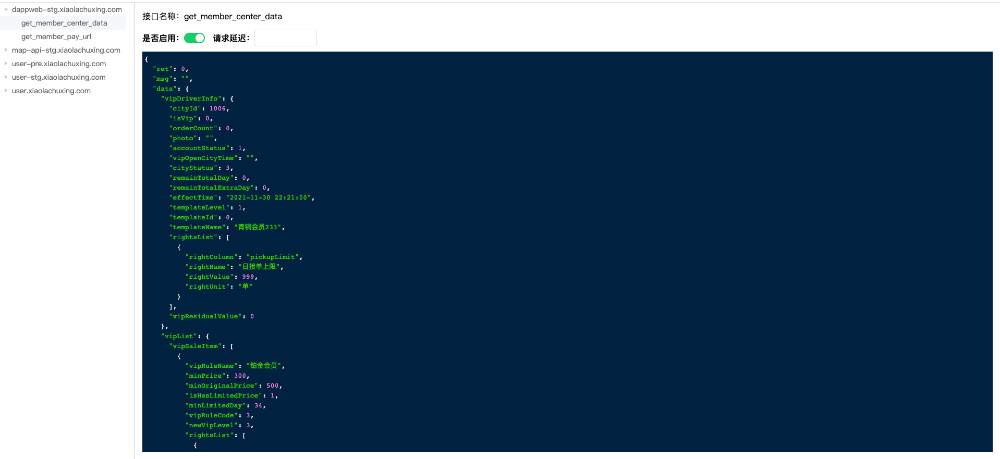

# whistle-mk

代理 mock 工具

## 安装

安装 whistle-mk

```
npm install whistle-mk -g
```

安装完成之后可通过执行 w-mock -h 查看可用的命令

```
$w-mock -h
Usage: w-mock [options] [command]

Options:
  -V, --version    output the version number
  -h, --help       display help for command

Commands:
  setup            信任证书 & 安装 helper
  start [options]  启动whistle-mk
  help [command]   display help for command
```

## 启动

安装证书及代理 helper

```
w-mock setup
```

启动 whistle-mk

```
w-mock start
```

启动成功之后可以访问 http://localhost:12333 或 http://local.whistlejs.com 看到 whistle 的主界面

访问 http://localhost:12333/whistle.mock 或 http://local.whistlejs.com/whistle-mk 可以看到 mock 界面

## 使用

在 whistle 的 rules 界面配置以下代理规则

```
*.qq.com/api mock://name resCors://enable
```

`mock://name`表示以请求参数中的 name 字段作为接口名称，`resCors://enable`表示设置 cors 头处理跨域，域名匹配规则可参考https://wproxy.org/whistle/pattern.html

访问匹配到 user\*.xiaolachuxing.com/api 的请求，会收集到 mock 中，可在 mock 界面中对响应数据进行修改或者设置接口延迟。

<!--  -->

## 规则说明

```
... mock://{apiName}
```

apiName 为 get 或 post 请求参数中的属性值，适用于 url 唯一通过请求参数区分接口名的 api，比如 easyopen，graphql 类型的 api。

```
... mock://
```

不配置 apiName 则用请求的 path 作为 apiName，适用于 Restful 风格的 api 接口
